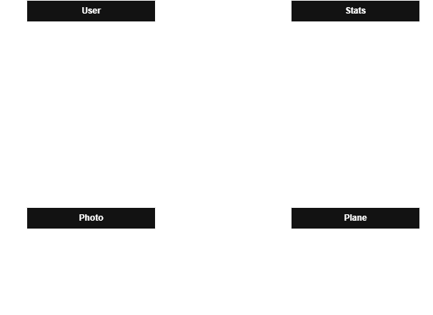

# PlaneSpOtter P3 Group 11
PlaneSpotter Backend

# Description
Implemented REST API's for our backend API hosted on Render by using SpringBoot, OAuth2, and Dockerfile. It handles the OAuth as well as the Planes used in frontend.

# Team Members
- Neil Cabanilla
- Daniel Everman
- Kristopher Church
- James Fisher

# Tech Stack
- SpringBoot
- Supabase
- DockerFile
- OAuth2(Google & Github)
- Render

# How to run
Just go to the file BackendApplication and run it. It should prompt you to localhost8080.

For Docker, must have docker app online and then do the following two commands...
- docker build -t planespotter . <-- This command first
- docker run --rm -p 8080:8080 planespotter  <-- Then finally this command after

# Live API URL
https://backend-eu81.onrender.com

#Swagger API
https://backend-eu81.onrender.com/swagger-ui.html

## Entity Relationship Diagram

